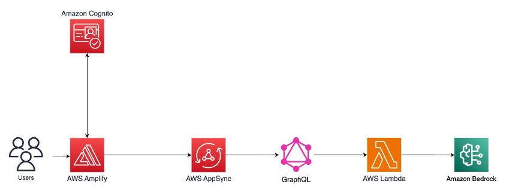

# 🍳 AI Recipe Generator

### Serverless Generative AI Application with AWS Amplify & Amazon Bedrock

```{=html}
<p align="center">
```

``{=html}
``{=html}
``{=html}
``{=html}
``{=html}
``{=html}
``{=html}

```{=html}
</p>
```

---

## 🚀 Overview

This project demonstrates how to build a **production-ready, serverless
Generative AI web application** using modern AWS services.

Users submit a list of ingredients, and the application generates a
complete recipe using **Claude 3 Sonnet via Amazon Bedrock**.

The architecture follows secure, scalable cloud-native design principles
used in real enterprise AI systems.

---

## 🏗 Architecture

    User → AWS Amplify → Cognito → AppSync (GraphQL) → Lambda → Amazon Bedrock (Claude 3 Sonnet)

    

### Service Responsibilities

Layer Service Purpose

---

Frontend AWS Amplify Hosting + CI/CD
Auth Amazon Cognito Secure authentication
API AWS AppSync GraphQL interface
Compute AWS Lambda Backend logic & AI invocation
AI Amazon Bedrock Claude 3 Sonnet inference

---

## ✨ Features

- Fully serverless architecture
- Secure authentication with Cognito
- GraphQL API abstraction layer
- Lambda backend isolation for AI model access
- Claude 3 Sonnet integration
- Continuous deployment via Amplify
- Clean HTML-based UI

---

## 🛠 Tech Stack

- AWS Amplify
- Amazon Cognito
- AWS AppSync (GraphQL)
- AWS Lambda
- Amazon Bedrock
- Claude 3 Sonnet
- Vite + TypeScript

---

## 🔐 Security Design

- AI model access restricted to Lambda execution role
- No direct frontend-to-Bedrock calls
- IAM least-privilege configuration
- Authenticated user flows via Cognito

Example required IAM permission:

```json
{
  "Effect": "Allow",
  "Action": "bedrock:InvokeModel",
  "Resource": "*"
}
```

---

## ⚙️ Deployment Workflow

### 1️⃣ Initialize Amplify

```bash
amplify init
```

### 2️⃣ Add Authentication

```bash
amplify add auth
amplify push
```

### 3️⃣ Add GraphQL API

```bash
amplify add api
amplify push
```

### 4️⃣ Deploy Frontend

```bash
amplify publish
```

Amplify enables automatic redeployment on push to `main`.

---

## 🧠 Bedrock Integration Example

```javascript
import {
  BedrockRuntimeClient,
  InvokeModelCommand,
} from "@aws-sdk/client-bedrock-runtime";

export const handler = async (event) => {
  const prompt = `Create a recipe using: ${event.arguments.ingredients}`;

  const client = new BedrockRuntimeClient({ region: process.env.AWS_REGION });

  const command = new InvokeModelCommand({
    modelId: "anthropic.claude-3-sonnet-20240229-v1:0",
    contentType: "application/json",
    accept: "application/json",
    body: JSON.stringify({
      anthropic_version: "bedrock-2023-05-31",
      messages: [{ role: "user", content: prompt }],
      max_tokens: 800,
    }),
  });

  const response = await client.send(command);
  const parsed = JSON.parse(new TextDecoder().decode(response.body));

  return parsed.content[0].text;
};
```

---

## 📦 Project Structure

    ├── src/
    ├── public/
    ├── amplify/
    ├── index.html
    ├── package.json
    ├── vite.config.ts
    └── README.md

---

## 📈 Why This Architecture?

- Horizontally scalable
- Secure AI access pattern
- Cloud-native best practices
- Clean separation of concerns
- Production-aligned generative AI pattern

---

## 🧪 Local Development

```bash
npm install
npm run dev
```

---

## 🔮 Future Enhancements

- Streaming Bedrock responses
- DynamoDB recipe storage
- Prompt tuning layer
- Guardrails integration
- Cost monitoring dashboard
- Recipe rating & persistence

---

## 📄 License

BSD 3-Clause License

---

### 💡 Portfolio Note

This project demonstrates practical experience integrating Generative AI
into a secure, scalable AWS architecture using real production patterns.
